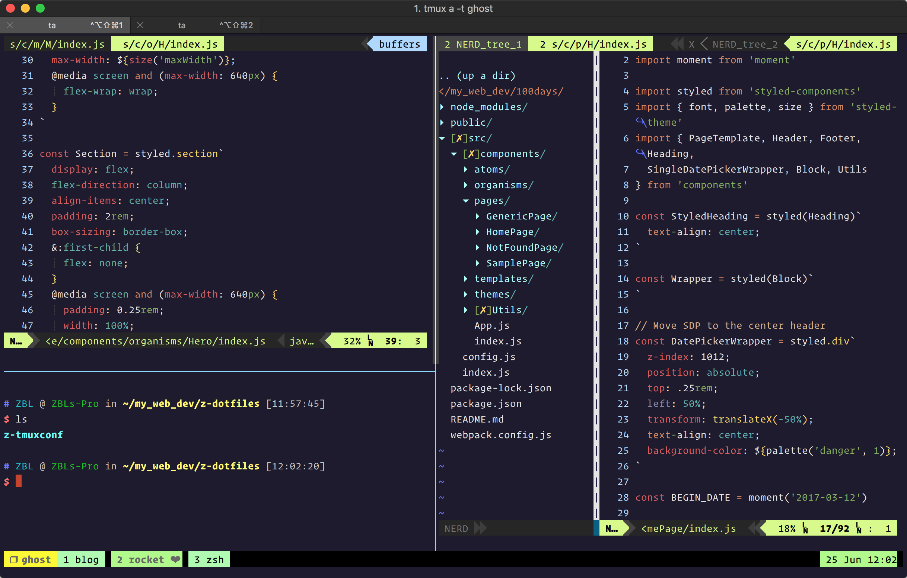
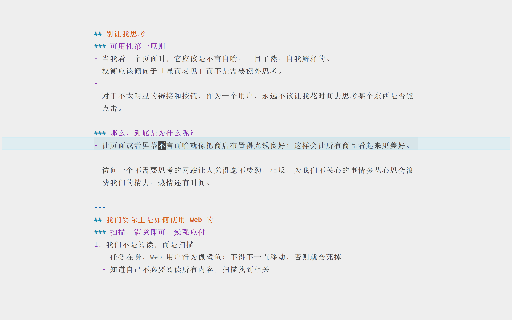

# Z-Dotfiles

Hi, there are my dotfiles, tmux config, zsh config, vim config, iTerm2 config, etc...

## Preview
### My Tmux Dark Theme

### My Vim Writer Light Theme

### TODO:
- `install.sh | setup.sh`
- Features
- Symlink to `$HOME`

## Enjoy your coding. 😆

Thanks to [Mathiasbynes  dotfiles](https://github.com/mathiasbynens/dotfiles/)
